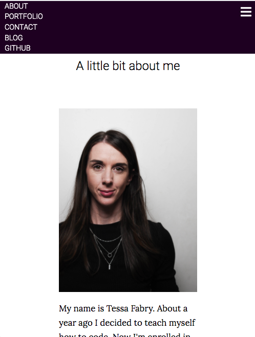

Website URL
---
https://keen-babbage-aa7ed6.netlify.com/index.html

Git Repository
---
https://github.com/tessssssssy/portfolio-site

Purpose
---
The portfolio website's purpose is to showcase a  portfolio of web development projects to prospective employers. 
- The site itself should demonstrate my skills in front end web development(HTML and CSS) and responsive web design
- It should showcase projects I have completed, demonstrating my skills in different areas of web development
- It should give visitors information about myself, my background and technical skills 

Functionality / Features
---
- Portfolio page displaying my projects, with links to git repositories and urls (if deployed)

- About section, explaining who I am and details of my technical skills 
- A contact page with a form linking to my email (using formspree)
- links to various professional/social accounts - github, linkedin, twitter etc
- blog page
- The site should be responsive - with a clean, easy to navigate user interface on both web and mobile
- An eye-catching color scheme and design

Sitemap
---

Screenshots
---
Landing

Portfolio

Portfolio - mobile

About

About - mobile

Contact

Blog

Target audience
---
This site is intended for prospective employers. This could include both technical people such as CTO's and senior developers  and non technical users such as HR managers etc. Therefore it is important to include features that are relevant to each audience. While screenshots of code and links to git repositories will be mostly relevant to other developers, it is also important to include visuals of projects and their features, as well as links to deployed sites where they exist, to engage a wider audience. 

Tech stack
---
- HTML
- CSS
- SASS
- Javascript
- Netlify
- Formspree
- Git/Github

Wireframes 
---

Landing Page

Portfolio

Portfolio - Mobile

I made two options for the mobile layout, I decided to go with the one on the left 

About

About mobile

Contact

Blog

